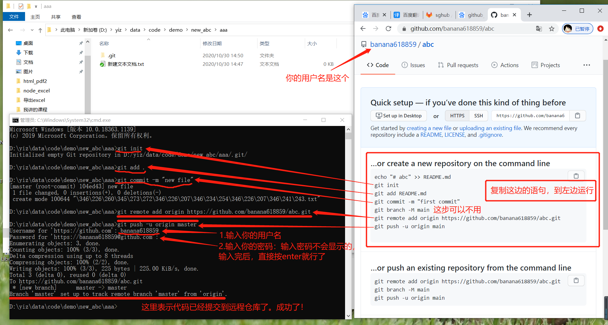

### 新手入门github

#### 一、为什么要github

​	github是一个代码管理平台。

​	例如：一个公司的开发团队有10个人要一起开发一款软件。因为要分工合作，每个人都负责软件的某部分功能。（如，张三：开发登录界面，李四：开发注册界面，王五...）那么怎么保证大家的代码不重复，而且当有重复的时候能提示出来呢？怎么保证代码的各个版本都能保存下来呢？

 	因此github就应运而生了，它帮我们管理这些代码，保存代码，每次都能看到大家都改了什么。非常适合团队开发的代码管理。

### 二、新手如何使用github

1. 去github官网注册账号

   https://github.com/

   

   

   然后：

   

   

2. 用注册好的账号登录github

   

   

   

3. 登录成功后，进入主页

   创建仓库：

   

   

   

   简单介绍功能：先了解一下：（这里看不懂，没关系，往下看，看到最后就懂了。）

   

   

4. 创建本地仓库（回到自己电脑文件夹）

   

   

   然后

   

   然后
   

   然后
   

   

   然后
   

   

   然后
   

   

   然后：依次输入下面这些命令
   

   

   
   然后
   
   
   
   最后，就成功了。
   

如果有不明白，可以qq问我哈，qq：804552579